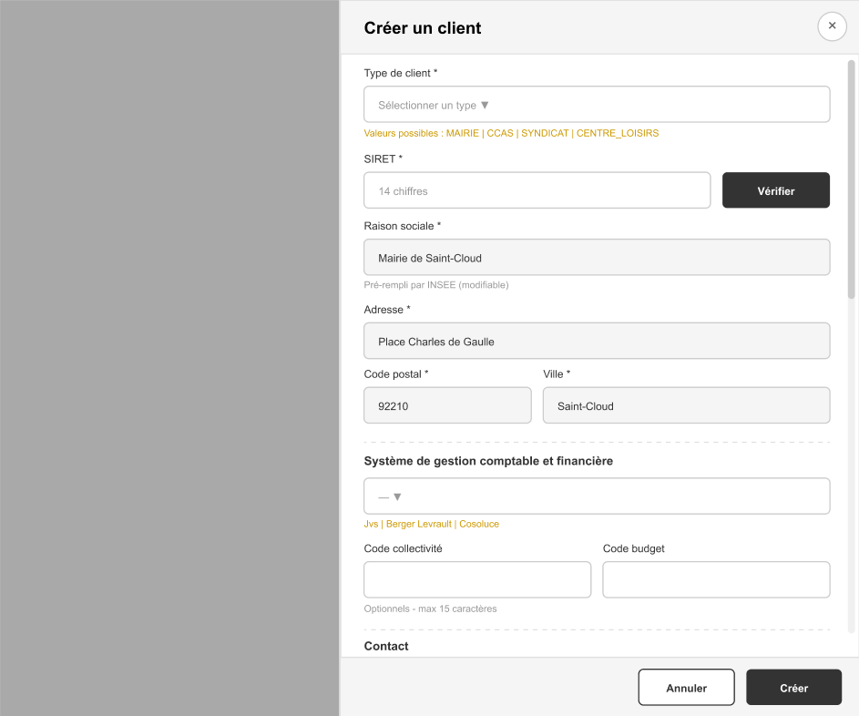

# 📋 Spécification Fonctionnelle - API Création Client

## SOFT-M - UC1-02 Drawer Création Client
### Version 1.0 - Décembre 2024

---


## Wireframe de référence



*Drawer de création client (50% largeur écran) - Layout une colonne, scrollable*

---

## 1. Contexte

Cette spécification décrit l'API de création d'un client (collectivité territoriale) dans le système SOFT-M. Elle correspond au drawer UC1-02 accessible depuis la liste des clients (UC1-01).

**Endpoint** : `POST /api/v1/clients`


---

## 2. Champs du formulaire

### 2.1 Vue d'ensemble

| # | Champ | Nom technique | Type | Obligatoire | Validation |
|---|-------|---------------|------|-------------|------------|
| 1 | Type de client | `client_type` | ENUM | ✅ Oui | Valeur dans ENUM |
| 2 | SIRET | `siret` | String | ✅ Oui | 14 chiffres, unique |
| 3 | Raison sociale | `name` | String | ✅ Oui | 1-255 caractères |
| 4 | Adresse | `address` | String | ✅ Oui | 1-255 caractères |
| 5 | Code postal | `postal_code` | String | ✅ Oui | 5 chiffres |
| 6 | Ville | `city` | String | ✅ Oui | 1-100 caractères |
| 7 | Système gestion comptable | `accounting_system` | ENUM | ❌ Non | Valeur dans ENUM ou NULL |
| 8 | Code collectivité | `collectivity_code` | String | ❌ Non | Max 15 caractères |
| 9 | Code budget | `budget_code` | String | ❌ Non | Max 15 caractères |
| 10 | Email de contact | `email` | String | ✅ Oui | Format email valide |
| 11 | Téléphone | `phone` | String | ✅ Oui | Format téléphone FR |

---

## 3. Détail des champs

### 3.1 Type de client (`client_type`) ✅ Obligatoire

**Description** : Type de collectivité territoriale

**Type** : ENUM (String)

**Valeurs possibles** :
| Valeur | Libellé UI |
|--------|------------|
| `MAIRIE` | Mairie |
| `CCAS` | CCAS |
| `SYNDICAT` | Syndicat Intercommunal |
| `CENTRE_LOISIRS` | Centre de Loisirs |

**Validation** :
- Doit être une des valeurs de l'ENUM
- Erreur si vide ou valeur inconnue

**Exemple** : `"MAIRIE"`

---

### 3.2 SIRET (`siret`) ✅ Obligatoire

**Description** : Numéro SIRET de la collectivité (identifiant légal français)

**Type** : String

**Validation** :
- Exactement 14 chiffres
- Regex : `^[0-9]{14}$`
- **UNIQUE** dans la base de données
- Peut être vérifié via API INSEE (voir section 5)

**Erreurs** :
| Code | Message |
|------|---------|
| `INVALID_FORMAT` | "Le SIRET doit contenir exactement 14 chiffres" |
| `DUPLICATE` | "Ce SIRET est déjà enregistré dans le système" |

**Exemple** : `"21920063500014"`

---

### 3.3 Raison sociale (`name`) ✅ Obligatoire

**Description** : Nom officiel de la collectivité

**Type** : String

**Validation** :
- Minimum 1 caractère
- Maximum 255 caractères
- Trim automatique des espaces

**Note** : Ce champ peut être pré-rempli par l'API INSEE après vérification du SIRET (côté frontend), mais reste modifiable par l'utilisateur.

**Exemple** : `"Mairie de Saint-Cloud"`

---

### 3.4 Adresse (`address`) ✅ Obligatoire

**Description** : Adresse postale (numéro et rue)

**Type** : String

**Validation** :
- Minimum 1 caractère
- Maximum 255 caractères
- Trim automatique des espaces

**Note** : Pré-rempli par API INSEE, modifiable.

**Exemple** : `"Place Charles de Gaulle"`

---

### 3.5 Code postal (`postal_code`) ✅ Obligatoire

**Description** : Code postal français

**Type** : String

**Validation** :
- Exactement 5 chiffres
- Regex : `^[0-9]{5}$`

**Erreur** : `"Le code postal doit contenir 5 chiffres"`

**Exemple** : `"92210"`

---

### 3.6 Ville (`city`) ✅ Obligatoire

**Description** : Nom de la commune

**Type** : String

**Validation** :
- Minimum 1 caractère
- Maximum 100 caractères
- Trim automatique des espaces

**Exemple** : `"Saint-Cloud"`

---

### 3.7 Système de gestion comptable (`accounting_system`) ❌ Optionnel

**Description** : Logiciel de gestion comptable et financière utilisé par la collectivité

**Type** : ENUM (String) ou NULL

**Valeurs possibles** :
| Valeur | Libellé UI |
|--------|------------|
| `NULL` | — (non renseigné) |
| `JVS` | Jvs |
| `BERGER_LEVRAULT` | Berger Levrault |
| `COSOLUCE` | Cosoluce |

**Validation** :
- Si fourni, doit être une des valeurs de l'ENUM
- Peut être NULL ou absent

**Exemple** : `"BERGER_LEVRAULT"` ou `null`

---

### 3.8 Code collectivité (`collectivity_code`) ❌ Optionnel

**Description** : Code d'identification interne de la collectivité (pour intégration comptable)

**Type** : String ou NULL

**Validation** :
- Maximum 15 caractères
- Caractères alphanumériques autorisés
- Peut être NULL ou chaîne vide

**Exemple** : `"COLL92210"` ou `null`

---

### 3.9 Code budget (`budget_code`) ❌ Optionnel

**Description** : Code budget pour l'intégration avec le système comptable

**Type** : String ou NULL

**Validation** :
- Maximum 15 caractères
- Caractères alphanumériques autorisés
- Peut être NULL ou chaîne vide

**Exemple** : `"BUD2024"` ou `null`

---

### 3.10 Email de contact (`email`) ✅ Obligatoire

**Description** : Adresse email principale de contact de la collectivité

**Type** : String

**Validation** :
- Format email valide (RFC 5322)
- Regex suggéré : `^[^\s@]+@[^\s@]+\.[^\s@]+$`
- Maximum 255 caractères
- Trim automatique
- Conversion en minuscules recommandée

**Erreur** : `"Format d'email invalide"`

**Exemple** : `"contact@mairie-saint-cloud.fr"`

---

### 3.11 Téléphone (`phone`) ✅ Obligatoire

**Description** : Numéro de téléphone principal de la collectivité

**Type** : String

**Validation** :
- Format téléphone français accepté
- Formats valides : `01 XX XX XX XX`, `+33 X XX XX XX XX`, `01XXXXXXXX`
- Regex suggéré : `^(\+33|0)[1-9](\s?[0-9]{2}){4}$`
- Stockage recommandé : format normalisé `+33XXXXXXXXX`

**Erreur** : `"Format de téléphone invalide"`

**Exemple** : `"+33146021234"` ou `"01 46 02 12 34"`

---

## 4. Requête API

### 4.1 Endpoint

```
POST /api/v1/clients
```

### 4.2 Headers

```
Content-Type: application/json
Authorization: Bearer {token}
```

### 4.3 Body (exemple complet)

```json
{
  "client_type": "MAIRIE",
  "siret": "21920063500014",
  "name": "Mairie de Saint-Cloud",
  "address": "Place Charles de Gaulle",
  "postal_code": "92210",
  "city": "Saint-Cloud",
  "accounting_system": "BERGER_LEVRAULT",
  "collectivity_code": "COLL92210",
  "budget_code": "BUD2024",
  "email": "contact@mairie-saint-cloud.fr",
  "phone": "+33146021234"
}
```

### 4.4 Body (exemple minimal - champs obligatoires uniquement)

```json
{
  "client_type": "MAIRIE",
  "siret": "21920063500014",
  "name": "Mairie de Saint-Cloud",
  "address": "Place Charles de Gaulle",
  "postal_code": "92210",
  "city": "Saint-Cloud",
  "email": "contact@mairie-saint-cloud.fr",
  "phone": "+33146021234"
}
```

---

## 5. Réponses API

### 5.1 Succès (201 Created)

```json
{
  "id": "550e8400-e29b-41d4-a716-446655440000",
  "name": "Mairie de Saint-Cloud",
 }
```

**Note** : Le champ `status` est automatiquement défini à `DRAFT` lors de la création.

### 5.2 Erreur de validation (400 Bad Request)

```json
{
  "error": "VALIDATION_ERROR",
  "message": "Erreurs de validation",
  "details": [
    {
      "code": "INVALID_FORMAT",
      "message": "Le SIRET doit contenir exactement 14 chiffres"
    },
    {
      "code": "INVALID_FORMAT",
      "message": "Format d'email invalide"
    }
  ]
}
```

### 5.3 Doublon SIRET (409 Conflict)

```json
{
  "error": "DUPLICATE_ENTRY",
  "message": "Ce SIRET est déjà enregistré dans le système"
}
```

### 5.4 Non autorisé (403 Forbidden)

```json
{
  "error": "FORBIDDEN",
  "message": "Accès refusé."
}
```

---

## 6. API INSEE (Lookup SIRET)

### 6.1 Description

Avant de soumettre le formulaire, le frontend peut vérifier le SIRET via l'API INSEE pour pré-remplir les champs.

**Endpoint** : `GET /api/v1/clients/insee/{siret}`

### 6.2 Réponse succès

```json
{
  "siret": "21920063500014",
  "siren": "219200635",
  "name": "COMMUNE DE SAINT CLOUD",
  "address": "PLACE CHARLES DE GAULLE",
  "postal_code": "92210",
  "city": "SAINT-CLOUD",
  "naf_code": "8411Z",
  "creation_date": "1983-03-01",
  "is_active": true
}
```

### 6.3 SIRET non trouvé (404)

```json
{
  "error": "NOT_FOUND",
  "message": "SIRET non trouvé dans la base INSEE"
}
```

**Note** : Si l'API INSEE est indisponible, le frontend permet la saisie manuelle de tous les champs.

---

## 7. Schéma Base de Données

### 7.1 Table `clients`

```sql
CREATE TABLE clients (
    id CUID PRIMARY KEY DEFAULT gen_random_cuid(),
    
    -- Identification
    client_type VARCHAR(20) NOT NULL,
    siret VARCHAR(14) NOT NULL UNIQUE,
    name VARCHAR(255) NOT NULL,
    
    -- Adresse
    address VARCHAR(255) NOT NULL,
    postal_code VARCHAR(5) NOT NULL,
    city VARCHAR(100) NOT NULL,
    
    -- Comptabilité
    accounting_system VARCHAR(20),
    collectivity_code VARCHAR(15),
    budget_code VARCHAR(15),
    
    -- Contact
    email VARCHAR(255) NOT NULL,
    phone VARCHAR(20) NOT NULL,
    
    -- Métadonnées
    status VARCHAR(20) NOT NULL DEFAULT 'DRAFT',
    created_at TIMESTAMP WITH TIME ZONE DEFAULT NOW(),
    updated_at TIMESTAMP WITH TIME ZONE DEFAULT NOW()
);

-- Index
CREATE UNIQUE INDEX idx_clients_siret ON clients(siret) WHERE deleted_at IS NULL;
CREATE INDEX idx_clients_status ON clients(status);
CREATE INDEX idx_clients_type ON clients(client_type);
```

### 7.2 ENUM Types

```sql
-- Type de client
CREATE TYPE client_type_enum AS ENUM (
    'MAIRIE',
    'CCAS',
    'SYNDICAT',
    'CENTRE_LOISIRS'
);

-- Système comptable
CREATE TYPE accounting_system_enum AS ENUM (
    'JVS',
    'BERGER_LEVRAULT',
    'COSOLUCE'
);

-- Statut client
CREATE TYPE client_status_enum AS ENUM (
    'DRAFT',
    'ACTIVE',
    'SUSPENDED',
    'ARCHIVED'
);
```

---

## 8. Règles Métier

| Code | Règle |
|------|-------|
| RG-UC1-01 | Le SIRET doit être unique dans le système |
| RG-UC1-02 | Un client est créé avec le statut `DRAFT` par défaut |
| RG-UC1-03 | Le SIRET peut être modifié après création |
| RG-UC1-04 | La suppression est permanante

---
## 9. Règles de développement 

voir le prompt_guidelines

---

## 10. Changelog

| Version | Date | Modifications |
|---------|------|---------------|
| 1.0 | 2024-12-25 | Version initiale |

---

**Fin du document**
